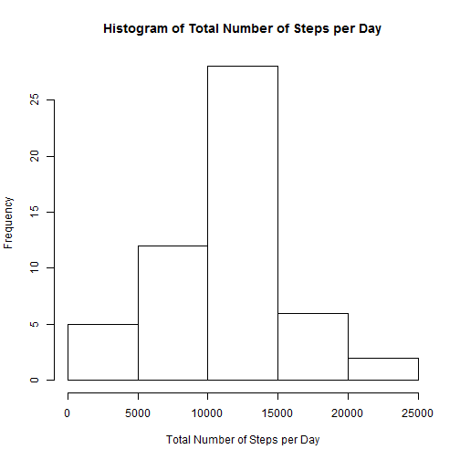

## Loading and preprocessing the data
Check for existance of the dataset file.
If not exists then download it directly from its source.

```r
url<-"https://d396qusza40orc.cloudfront.net/repdata%2Fdata%2Factivity.zip";
zip <- basename(url);
zip <- gsub("%2F", "_", zip);
file <- "activity.csv";
if (!file.exists(file)) {
    print(paste0("Download ", url, " :"));
    download.file(url, zip, method="curl");
}
print(paste0("Unzip ", zip, " :"));
```

```
## [1] "Unzip repdata_data_activity.zip :"
```

```r
unzip(zip);
df <- read.csv(file);
summary(df);
```

```
##      steps                date          interval     
##  Min.   :  0.00   2012-10-01:  288   Min.   :   0.0  
##  1st Qu.:  0.00   2012-10-02:  288   1st Qu.: 588.8  
##  Median :  0.00   2012-10-03:  288   Median :1177.5  
##  Mean   : 37.38   2012-10-04:  288   Mean   :1177.5  
##  3rd Qu.: 12.00   2012-10-05:  288   3rd Qu.:1766.2  
##  Max.   :806.00   2012-10-06:  288   Max.   :2355.0  
##  NA's   :2304     (Other)   :15840
```

```r
str(df);
```

```
## 'data.frame':	17568 obs. of  3 variables:
##  $ steps   : int  NA NA NA NA NA NA NA NA NA NA ...
##  $ date    : Factor w/ 61 levels "2012-10-01","2012-10-02",..: 1 1 1 1 1 1 1 1 1 1 ...
##  $ interval: int  0 5 10 15 20 25 30 35 40 45 ...
```


## What is mean total number of steps taken per day?
Missing values in the dataset are ignored  
1. Calculate the total number of steps taken per day  
2. Calculate and report the mean and median of the total number of steps taken per day  
3. Make a histogram of the total number of steps taken each day  

```r
library(stats);
totals <- aggregate(steps ~ date, df, sum, na.action=na.omit);
meanTotals <- mean(totals[, 2]);
medianTotals <- median(totals[, 2]);
```
The mean total number of steps per day is **1.0766189 &times; 10<sup>4</sup>**  
The median total number of steps per day is **10765**  

```r
hist(totals$steps, main="Histogram of Total Number of Steps per Day",
     xlab="Total Number of Steps per Day");
```

 


## What is the average daily activity pattern?
1. Make a time series plot (i.e. type = "l") of the 5-minute interval (x-axis) and the average number of steps taken, averaged across all days (y-axis)  
2. Which 5-minute interval, on average across all the days in the dataset, contains the maximum number of steps?  

```r
averages <- aggregate(steps ~ interval, df, mean, na.action=na.omit);
with(averages, plot(steps ~ interval, type='l', main="Average Daily Activity Pattern",
                    ylab="Number of steps", xlab="Interval"));
```

 

```r
maxAverageIndex <- which.max(averages$steps);
maxAverageInterval <- averages[maxAverageIndex, "interval"];
maxAverageSteps <- averages[maxAverageIndex, "steps"];
```
The interval of maximum average steps is **835**  
The maximum average steps is **206.1698113**  


## Imputing missing values
1. Calculate and report the total number of missing values in the dataset (i.e. the total number of rows with NAs)  
2. Devise a strategy for filling in all of the missing values in the dataset. The strategy does not need to be sophisticated. For example, you could use the mean/median for that day, or the mean for that 5-minute interval, etc.
3. Create a new dataset that is equal to the original dataset but with the missing data filled in.  
4. Make a histogram of the total number of steps taken each day and Calculate and report the mean and median total number of steps taken per day. Do these values differ from the estimates from the first part of the assignment? What is the impact of imputing missing data on the estimates of the total daily number of steps?

```r
# calculte the number of missing values
numNa <- sum(is.na(df$steps));
# Add a new column of steps where all the missing values are replaced by average
# of their interval
df$imputedNaSteps <- df$steps;
j = 1; # running index in the average data frame
for (i in 1:nrow(df)) {
    while (averages[j, "interval"] < df[i, "interval"])
        j = j + 1;
    if (is.na(df[i, "steps"])) {
        df[i, "imputedNaSteps"] <- averages[j, "steps"]
    }
}
```
The number of missing values in the original dataset is **2304**

```r
totalsimputedNa <- aggregate(imputedNaSteps ~ date, df, sum);
hist(totalsimputedNa$imputedNaSteps,
     main="Histogram of Total Number of Steps per Day\n with Imputed Missing Values",
     xlab="Total Number of Steps per Day");
```

 


## Are there differences in activity patterns between weekdays and weekends?
1. Create a new factor variable in the dataset with two levels - "weekday" and "weekend" indicating whether a given date is a weekday or weekend day.  
2. Make a panel plot containing a time series plot (i.e. type = "l") of the 5-minute interval (x-axis) and the average number of steps taken, averaged across all weekday days or weekend days (y-axis). See the README file in the GitHub repository to see an example of what this plot should look like using simulated data.  

```r
# add a factor "W"" with levels "weekday" or "weekend"
w<-weekdays(as.Date(df$date));
isWeekend <- (w=="Saturday") | (w=="Sunday");
df$W <- factor(isWeekend, labels=c("weekday", "weekend"))
# separate according to "W" into two data frames and re-calculate their
# averages separately 
dfWeekday <- df[df$W=="weekday", ]
dfWeekend <- df[df$W=="weekend", ]
averagesWeekday <- aggregate(imputedNaSteps ~ interval, dfWeekday, mean);
averagesWeekend <- aggregate(imputedNaSteps ~ interval, dfWeekend, mean);
# add again the "W" factor and row-bind them
averagesWeekday$W <- rep("weekday", nrow(averagesWeekday));
averagesWeekend$W <- rep("weekend", nrow(averagesWeekend));
averagesW <- rbind(averagesWeekday, averagesWeekend);
averagesW$W <- as.factor(averagesW$W);
# make the panel plot, break according to "W"
library(lattice);
with(averagesW, xyplot(imputedNaSteps ~ interval | W, type='l',
                       ylab="Number of steps", xlab="Interval", layout=c(1,2)));
```

 
